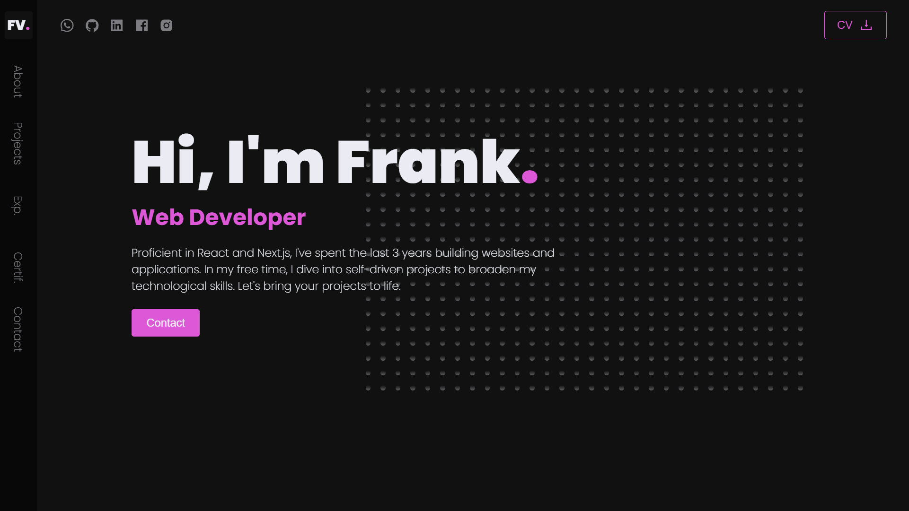

<div align="center">
<h3>Portfolio</h3>
          
</div>

<h2>📋 Table of Contents</h2>

- ✨ [Introduction](#introduction)
- ⚙️ [Tech Stack](#tech-stack)
- 📝 [Features](#features)
- 🚀 [Quick Start](#quick-start)


## <a name="introduction">✨ Introduction</a>

**[EN]** A cutting-edge AI SaaS platform that enables users to create, discover, and enjoy podcasts with advanced features like text-to-audio conversion with multi-voice AI, podcast thumbnail Image generation and seamless playback. 

**[FR]** Une plateforme SaaS d'IA de pointe qui permet aux utilisateurs de créer, découvrir et apprécier des podcasts avec des fonctionnalités avancées telles que la conversion de texte en audio avec une IA multi-voix, la génération d'images de miniature de podcast et une lecture en continu sans accroc.

## <a name="tech-stack">⚙️ Tech Stack</a>

- Next.js
- TypeScript
- Convex
- OpenAI
- Clerk
- ShadCN
- Tailwind CSS

## <a name="features">📝 Features</a>

👉 **Robust Authentication**: Secure and reliable user login and registration system.

👉 **Modern Home Page**: Showcases trending podcasts with a sticky podcast player for continuous listening.

👉 **Discover Podcasts Page**: Dedicated page for users to explore new and popular podcasts.

👉 **Fully Functional Search**: Allows users to find podcasts easily using various search criteria.

👉 **Create Podcast Page**: Enables podcast creation with text-to-audio conversion, AI image generation, and previews.

👉 **Multi Voice AI Functionality**: Supports multiple AI-generated voices for dynamic podcast creation.

👉 **Profile Page**: View all created podcasts with options to delete them.

👉 **Podcast Details Page**: Displays detailed information about each podcast, including creator details, number of listeners, and transcript.

👉 **Podcast Player**: Features backward/forward controls, as well as mute/unmute functionality for a seamless listening experience.

👉 **Responsive Design**: Fully functional and visually appealing across all devices and screen sizes.

and many more, including code architecture and reusability 

## <a name="quick-start">🚀 Quick Start</a>

Follow these steps to set up the project locally on your machine.

**Dashboards**

- https://cloud.mongodb.com
- https://dashboard.clerk.com
- https://uploadthing.com/dashboard
- https://dashboard.stripe.com
- https://platform.openai.com

<br/>**Prerequisites**

Make sure you have the following installed on your machine:

- [Git](https://git-scm.com/)
- [Node.js](https://nodejs.org/en)
- [npm](https://www.npmjs.com/) (Node Package Manager)

<br/>**Cloning the Repository**

```bash
git clone https://github.com/adrianhajdin/jsm_podcastr.git
cd jsm_podcastr
```

<br/>**Installation**

Install the project dependencies using npm:

```bash
npm install
```

**Set Up Environment Variables**

Create a new file named `.env` in the root of your project and add the following content:

```env
# Convex
CONVEX_DEPLOYMENT=
NEXT_PUBLIC_CONVEX_URL=

# Clerk
NEXT_PUBLIC_CLERK_PUBLISHABLE_KEY=
CLERK_SECRET_KEY=
CLERK_WEBHOOK_SECRET=
NEXT_PUBLIC_CLERK_SIGN_IN_URL='/sign-in'
NEXT_PUBLIC_CLERK_SIGN_UP_URL='/sign-up'

# OpenAI
OPENAI_API_KEY=
```

Replace the placeholder values with your actual Convex & Clerk credentials. You can obtain these credentials by signing up on the [Convex](https://www.convex.dev/) and [Clerk](https://clerk.com/) websites.

<br/>**Running the Project**

```bash
npm run dev
npx convex dev
```

Open [http://localhost:3000](http://localhost:3000) in your browser to view the project.


## Let's get things running

This template is built on top of [NextJS](https://nextjs.org/), a full stack development framework built on top of React.

At the root of your project, you'll see a `package.json` file defining our dependencies.

Most of this is boilerplate, but I will call out the following three dependencies:

- `animejs` -> A javascript animation library, used for the grid animation inside of DotGrid.tsx
- `framer-motion` -> A react based animation library, used in a hand full of places (anywhere you see `<motion.el />` style components)
- `sass` -> All styling uses plain CSS and sass modules for this project

Now that's out of the way, you can get your project running by first installing dependencies.

From your terminal, run:

```
npm install
# or
yarn install
```

This will take a minute or two, but once that's done, you should be able to run the following command:

```
npm run dev
# or
yarn dev
```

This will start your project on `localhost:3000`

## The file structure

Because this is a NextJS project, we follow the standard NextJS pattern for organizing this project.

Inside of the `pages/` directly you'll find 3 files:

- `_app.tsx` -> A file which wraps around every page in our app. Here we import the Poppins font and include it in our page. You can change to use whatever font you'd like here ([docs](https://nextjs.org/docs/basic-features/font-optimization)).
- `_document.tsx` -> Essentially the NextJS version of your base "HTML document". Nothing fancy here.
- `_index.tsx` -> This represents our home route. We include 1 single component here called `<Home />`. Click into this component to begin exploring.

To add MORE routes to your project, see [this doc](https://nextjs.org/docs/basic-features/pages).

Inside of the `styles/` directly you'll find find a global CSS file. This just includes a basic reset, as well as a couple of classes we use throughout the project.

Inside of the `components/` directory you'll find all of the good stuff. The `components/home/` directory houses the majority of what you'll like want to edit

## Styling

Global styling (colors mainly) are defined using CSS variables in the `styles/globals.css` file.

```
  --background: rgb(17, 17, 17);
  --bg-opaque: rgb(17, 17, 17, 0.25);
  --background-light: rgb(35, 35, 35);
  --background-dark: rgb(8, 8, 8);

  --text: rgb(235, 236, 243);
  --brand: rgb(10, 255, 157);

  --text-xs: 1.6rem;
  --text-sm: 1.8rem;
  --text-md: 2.2rem;
  --text-lg: 3.6rem;
  --text-xl: 5.6rem;
  --text-2xl: 9.6rem;
```

The first six variables are the colors for the app. The last six are font sizes. Play around with these a bit to start making it your own.

## More info

That's the basics! If you're comfortable digging in yourself, then you should be set.
